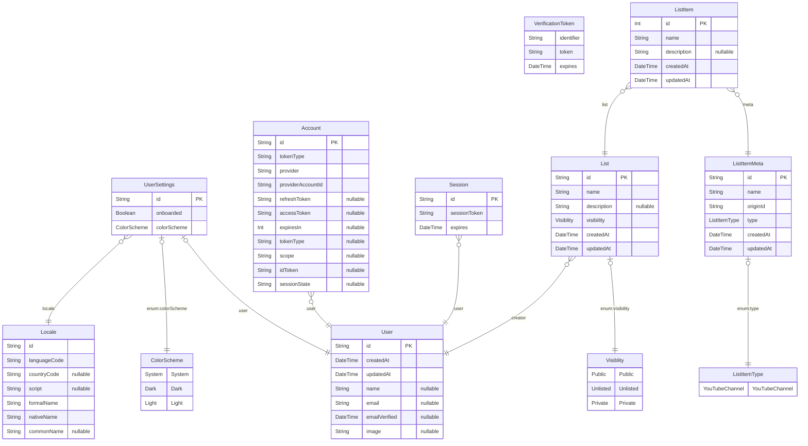

```mermaid
erDiagram

        ColorScheme {
            System System
Dark Dark
Light Light
        }
    


        Visiblity {
            Public Public
Unlisted Unlisted
Private Private
        }
    


        ListItemType {
            YouTubeChannel YouTubeChannel
        }
    
  User {
    String id PK 
    DateTime createdAt  
    DateTime updatedAt  
    String name  "nullable"
    String email  "nullable"
    DateTime emailVerified  "nullable"
    String image  "nullable"
    }
  

  UserSettings {
    String id PK 
    Boolean onboarded  
    ColorScheme colorScheme  
    }
  

  Locale {
    String id  
    String languageCode  
    String countryCode  "nullable"
    String script  "nullable"
    String formalName  
    String nativeName  
    String commonName  "nullable"
    }
  

  Account {
    String id PK 
    String tokenType  
    String provider  
    String providerAccountId  
    String refreshToken  "nullable"
    String accessToken  "nullable"
    Int expiresIn  "nullable"
    String tokenType  "nullable"
    String scope  "nullable"
    String idToken  "nullable"
    String sessionState  "nullable"
    }
  

  Session {
    String id PK 
    String sessionToken  
    DateTime expires  
    }
  

  VerificationToken {
    String identifier  
    String token  
    DateTime expires  
    }
  

  List {
    String id PK 
    String name  
    String description  "nullable"
    Visiblity visibility  
    DateTime createdAt  
    DateTime updatedAt  
    }
  

  ListItem {
    Int id PK 
    String name  
    String description  "nullable"
    DateTime createdAt  
    DateTime updatedAt  
    }
  

  ListItemMeta {
    String id PK 
    String name  
    String originId  
    ListItemType type  
    DateTime createdAt  
    DateTime updatedAt  
    }
  
    UserSettings o|--|| ColorScheme : "enum:colorScheme"
    UserSettings o|--|| User : "user"
    UserSettings o{--|| Locale : "locale"
    Account o{--|| User : "user"
    Session o{--|| User : "user"
    List o|--|| Visiblity : "enum:visibility"
    List o{--|| User : "creator"
    ListItem o{--|| ListItemMeta : "meta"
    ListItem o{--|| List : "list"
    ListItemMeta o|--|| ListItemType : "enum:type"
```
