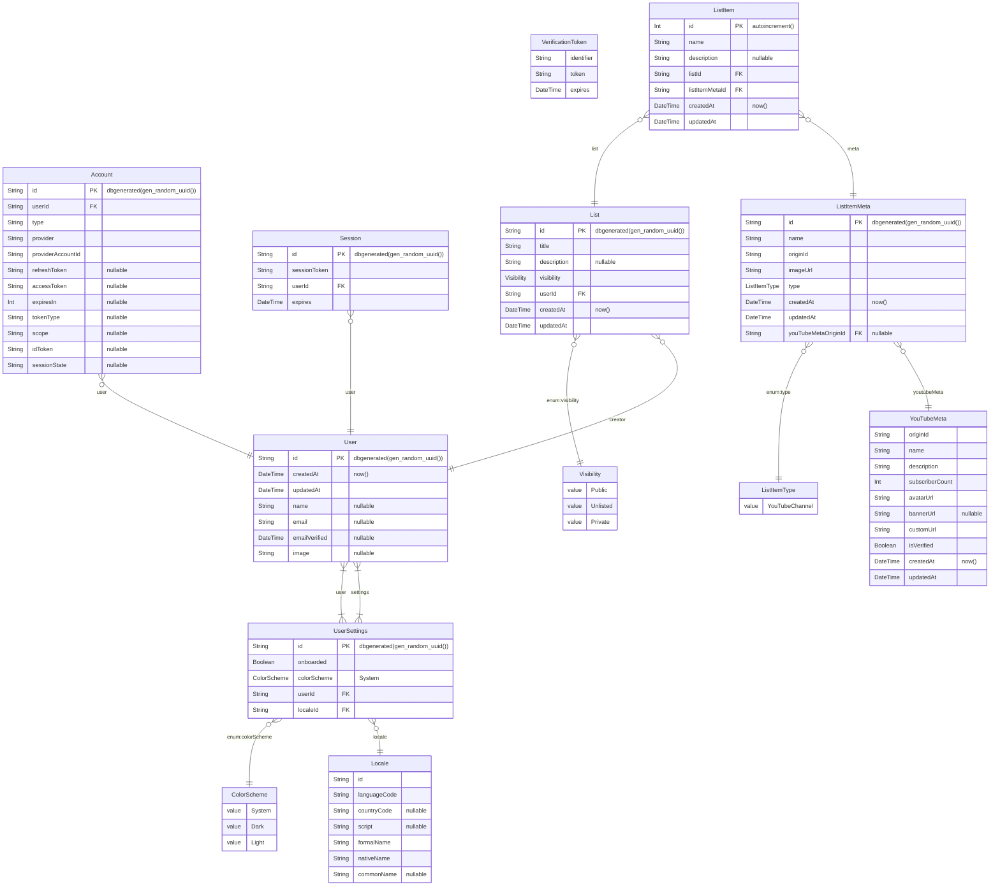

```mermaid
erDiagram
	ColorScheme {
		value System
		value Dark
		value Light
	}
	Visibility {
		value Public
		value Unlisted
		value Private
	}
	ListItemType {
		value YouTubeChannel
	}
	User {
		String id PK  "dbgenerated(gen_random_uuid())"
		DateTime createdAt  "now()"
		DateTime updatedAt
		String name  "nullable"
		String email  "nullable"
		DateTime emailVerified  "nullable"
		String image  "nullable"
	}
	UserSettings {
		String id PK  "dbgenerated(gen_random_uuid())"
		Boolean onboarded
		ColorScheme colorScheme "System"
		String userId FK
		String localeId FK
	}
	Locale {
		String id
		String languageCode
		String countryCode  "nullable"
		String script  "nullable"
		String formalName
		String nativeName
		String commonName  "nullable"
	}
	Account {
		String id PK  "dbgenerated(gen_random_uuid())"
		String userId FK
		String type
		String provider
		String providerAccountId
		String refreshToken  "nullable"
		String accessToken  "nullable"
		Int expiresIn  "nullable"
		String tokenType  "nullable"
		String scope  "nullable"
		String idToken  "nullable"
		String sessionState  "nullable"
	}
	Session {
		String id PK  "dbgenerated(gen_random_uuid())"
		String sessionToken
		String userId FK
		DateTime expires
	}
	VerificationToken {
		String identifier
		String token
		DateTime expires
	}
	List {
		String id PK  "dbgenerated(gen_random_uuid())"
		String title
		String description  "nullable"
		Visibility visibility
		String userId FK
		DateTime createdAt  "now()"
		DateTime updatedAt
	}
	ListItem {
		Int id PK  "autoincrement()"
		String name
		String description  "nullable"
		String listId FK
		String listItemMetaId FK
		DateTime createdAt  "now()"
		DateTime updatedAt
	}
	ListItemMeta {
		String id PK  "dbgenerated(gen_random_uuid())"
		String name
		String originId
		String imageUrl
		ListItemType type
		DateTime createdAt  "now()"
		DateTime updatedAt
		String youTubeMetaOriginId FK  "nullable"
	}
	YouTubeMeta {
		String originId
		String name
		String description
		Int subscriberCount
		String avatarUrl
		String bannerUrl  "nullable"
		String customUrl
		Boolean isVerified
		DateTime createdAt  "now()"
		DateTime updatedAt
	}
	User }|--|{ UserSettings : settings
	UserSettings }|--|{ User : user
	UserSettings }o--|| Locale : locale
	UserSettings }o--|| ColorScheme : "enum:colorScheme"
	Account }o--|| User : user
	Session }o--|| User : user
	List }o--|| User : creator
	List }o--|| Visibility : "enum:visibility"
	ListItem }o--|| ListItemMeta : meta
	ListItem }o--|| List : list
	ListItemMeta }o--|| YouTubeMeta : youtubeMeta
	ListItemMeta }o--|| ListItemType : "enum:type"

```
