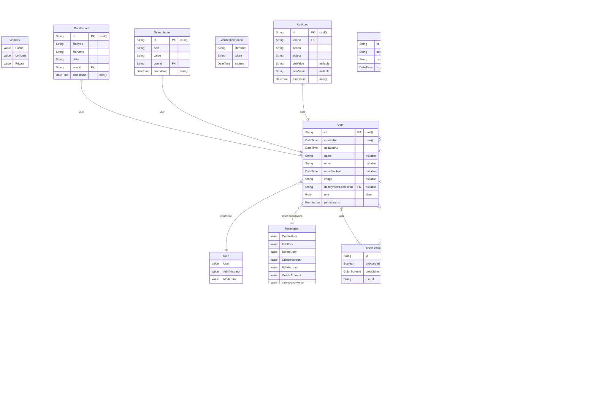

```mermaid
erDiagram
	Role {
		value User
		value Administrator
		value Moderator
	}
	Permission {
		value CreateUser
		value EditUser
		value DeleteUser
		value CreateAccount
		value EditAccount
		value DeleteAccount
		value CreateCoreValue
		value EditCoreValue
		value DeleteCoreValue
		value SubmitCoreValueReport
	}
	ColorScheme {
		value System
		value Dark
		value Light
	}
	Visibility {
		value Public
		value Unlisted
		value Private
	}
	User {
		String id PK  "cuid()"
		DateTime createdAt  "now()"
		DateTime updatedAt
		String name  "nullable"
		String email  "nullable"
		DateTime emailVerified  "nullable"
		String image  "nullable"
		String deploymentLocationId FK  "nullable"
		Role role "User"
		Permission permissions
	}
	UserSettings {
		String id PK  "cuid()"
		Boolean onboarded
		ColorScheme colorScheme "System"
		String userId FK
		String localeId FK
	}
	Locale {
		String id
		String languageCode
		String countryCode  "nullable"
		String script  "nullable"
		String formalName
		String nativeName
		String commonName  "nullable"
	}
	Account {
		String id PK  "cuid()"
		String userId FK
		String type
		String provider
		String providerAccountId
		String refreshToken  "nullable"
		String accessToken  "nullable"
		Int expiresIn  "nullable"
		String tokenType  "nullable"
		String scope  "nullable"
		String idToken  "nullable"
		String sessionState  "nullable"
	}
	Session {
		String id PK  "cuid()"
		String sessionToken
		String userId FK
		DateTime expires
	}
	VerificationToken {
		String identifier
		String token
		DateTime expires
	}
	CoreValue {
		String id PK  "cuid()"
		String name
		String description
		DateTime createdAt  "now()"
		DateTime updatedAt
	}
	CoreValueReport {
		String id PK  "cuid()"
		String userId FK
		String coreValueId FK
		DateTime date
		String description
	}
	DeploymentLocation {
		String id PK  "cuid()"
		String state
		String lga
		String ppa
	}
	AuditLog {
		String id PK  "cuid()"
		String userId FK
		String action
		String object
		String oldValue  "nullable"
		String newValue  "nullable"
		DateTime timestamp  "now()"
	}
	SearchIndex {
		String id PK  "cuid()"
		String field
		String value
		String userId FK
		DateTime timestamp  "now()"
	}
	DataExport {
		String id PK  "cuid()"
		String fileType
		String filename
		String data
		String userId FK
		DateTime timestamp  "now()"
	}
	User }|--|{ UserSettings : settings
	User ||--|| DeploymentLocation : deploymentLocation
	User }o--|| Role : "enum:role"
	User }o--|| Permission : "enum:permissions"
	UserSettings }|--|{ User : user
	UserSettings }o--|| Locale : locale
	UserSettings }o--|| ColorScheme : "enum:colorScheme"
	Account ||--|| User : user
	Session ||--|| User : user
	CoreValueReport }o--|| User : user
	CoreValueReport }o--|| CoreValue : coreValue
	AuditLog ||--|| User : user
	SearchIndex ||--|| User : user
	DataExport ||--|| User : user

```
